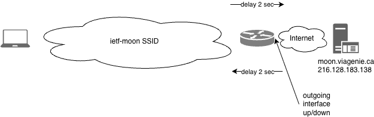
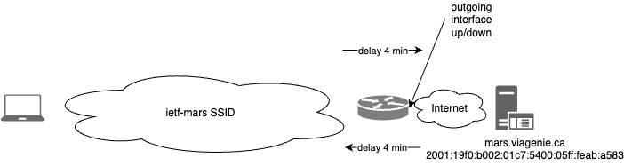

# IETF 124 Montréal TIPTOP/Deepspace Hackathon Experiment

As described in the [TIPTOP use case draft](https://datatracker.ietf.org/doc/draft-ietf-tiptop-usecase/), space communications have longer delays (~2 secs one-way delay to Moon, 4-22 mins to Mars) and intermittence (because relay orbiters going on the other side of the celestial body). The key adaptations to make the IP protocol stack working are (briefly, see [TIPTOP architecture draft](https://datatracker.ietf.org/doc/draft-many-tiptop-ip-architecture/) for details):

 - for forwarders facing intermittence, temporarily buffer(aka store) packets instead of dropping them, when an outgoing link goes down (or more generally when the destination route is withdrawn) 
 - adjust transport timers and congestion control
 - adjust application timers. 

Note that from the point of view of transport and applications, intermittence is not seen directly, but indirectly as a long variable delay. Currently, only UDP as non-reliable transport and [QUIC](https://datatracker.ietf.org/doc/draft-many-tiptop-quic-profile/) as reliable transport are discussed and implemented. There are no plans to update TCP. The [TIPTOP](https://datatracker.ietf.org/group/tiptop/about/) working group is making progress on those specifications. 

The purpose of this experiment is to:

- test implementations
- test transport configurations and congestion control strategies, 
- verify the usability (or the need to adapt) of IETF protocols 
- get experience on using applications
- learn the deepspace networking and communications environment

## Experiment Information

### Scenario
Using your laptop, you will be simulating a (Earth) ground space application talking to a Moon or Mars asset, such as a rover, with an orbiter as the relay in the path, as described in the following figure.

Each orbiter (one for Moon, one for Mars) is implemented as follows:

- a mini-pc running linux acting as an IP forwarder
- storing IP packets when outgoing interface is down
- broadcasting "ietf-moon" and "ietf-mars" SSIDs, respectively
- using netem, adding a 2 second or 4 minute one-way delay to Moon or Mars respectively
- putting the outgoing interface, facing the rover, down every 15 minutes, for 15 minutes; so interface is up from XX:00 to XX:14:59 and down from XX:15 to XX:29:59, up from XX:30 to XX:444:59 and down from XX:45 to XX:59.

The equivalent networks are shown for Moon:

 

and Mars:

 

The Moon (moon.viagenie.ca/216.128.183.138) and Mars (mars.viagenie.ca/216.128.181.1) assets are implemented as VMs on the other side of the routers, with QUIC servers answering on port 4443,  configured based on their respective expected delays and intermittence. They also run other services as described in the following sections.

While the use of the provided assets are suggested for testing, one can use any server on the Internet, which is on the other side of the routers, to verify, test or configure appropriately for delays. Note that without being configured for deepspace delays, they may time out or do excessive retransmissions. You are encouraged to test your implementation or any implementation on your servers and clients and see how the protocol and implementations behave.

The induced delay correspond to real scenarios for Moon and Mars. For Mars, it corresponds to the closest encounter of Mars and Earth: 4 minutes light time. 4 minutes was chosen so that the wait time is not too high but 4 minutes is enough to see the impact of deep space delays on applications and transport. Note that the 15 minute intermittence is not based on real scenarios, but more a matter of convenience, while still simulating the fundamental issue of intermittence.

### Congestion Control
As discussed in the [QUIC profile draft](https://datatracker.ietf.org/doc/draft-many-tiptop-quic-profile/), congestion control as we know it on Internet can not be applied as is in deep space because of the intermittence events that create very variable RTTs. For the moment, dumb, almost no op, congestion controllers were implemented in some QUIC stacks (see below). Work in progress is to implement rate-based open-loop congestion controllers.

### Things to Test

As discussed above, most transport and applications timers, on both client and servers, have to be configured for the expected delays. You are free and encouraged to experiment with non-configured clients on your laptop, and servers on Internet, to see if they work or not (spoiler: most won't as is). Instructions on how to test space profiled/configured QUIC stacks for HTTP and others are provided below for testing.

When using this experiment SSIDs (ietf-moon, ietf-mars), they will introduce significant delays, on purpose. During this experiment, you may need to install some open-source software or doing normal work, where the apps on your laptop will timeout and may say that you are not connected on the Internet. Switch back to the IETF network SSID in this case.

### QUIC Stacks 
Since our proposed code change to externalize the needed connection transport configuration parameters have been merged into their respective repository, the following QUIC stacks have the right configuration knobs/API endpoints available to test in this deepspace scenario.

- Quinn
- Quiche
- Neqo

A noop congestion controller was implemented either by using the QUIC stack as a library, in case of Quinn, or with a fork for Quiche and Neqo. 

Therefore, these implementations should be used for testing, as documented in [DIPT](https://github.com/deepspaceip/dipt-http).

### What to install and run on your laptop

#### Ping
To confirm your laptop is on the right network, do the following:

- switch to the `ietf-moon` SSID
- `ping -W 5 -c 2 216.128.183.138`
- wait about 5 seconds for the first reply
- switch to the `ietf-mars` SSID
- `ping -W 500 -c 2 216.128.181.1`
- wait about 8 minutes for the first reply

The -W argument specifies the time to wait for the response. Note that on Linux, the unit is seconds, while on MacOSX the unit is in milliseconds. :(

#### HTTP And QUIC
This setup was tested on Ubuntu and MacOSX. It is expected to run on any Linux distro. It uses the Rust toolchain, so make sure to [install it](https://rustup.rs). 

The setup will send a basic HTTP query over QUIC to space configured servers simulating Moon and Mars assets.

- switch to the main IETF network (ietf or ietf-dual-stack SSIDs), unless you want to install software over long delays!
- `git clone https://github.com/deepspaceip/dipt-http.git`
- `cd dipt-http`
- Choose whether you want to test with the Quinn or Quiche QUIC stack. See the README in their respective sub-directory and follow the instructions. The following assumes Quinn.
- `cd quinn`
- Compile and test before switching to the ietf-moon SSID network
  - `cargo run --release --bin client -- --no-verify --maxrtt 910 --cc noop https://216.128.183.138:4443/index.html`
- switch to `ietf-moon` SSID and then redo a get to the Moon asset: `cargo run --release --bin client -- --no-verify --maxrtt 910 --cc noop https://216.128.183.138:4443/index.html`
- switch to `ietf-mars` SSID and then do a get to the Mars asset: `cargo run --release --bin client -- --no-verify --maxrtt 1390 --cc noop https://216.128.181.1:4443/index.html`

The `--maxrtt` argument is based on the expected maximum RTT to the target asset. It is used internally to set the initial_rtt and max_idle_timeout transport connection configuration parameters. For moon, 15 minute intermittence (15 x 60s = 900 seconds) and 2x2 seconds means 904 seconds, so 910 for some leaway. Similarly, Mars is 15 minute intermittence and 2x4 minutes means 1390 seconds. The `--cc` sets the congestion controller to the noop one. The `--no-verify` tells the client to not verify the TLS certificate, as it is a self-signed one on the server side.

One shall see the response after the expected time. Note that, for a new connection, which is the case being tested above, QUIC takes one RTT to setup the connection and the TLS context, then the request and response, and then closing the connection. So the total time from connection start to close is more than 1 RTT. If the connection is started just before a link down event on the orbiter, then the reply will be delayed by the intermittence period. It is expected that in deep space deployment, the connections will be long-lived and therefore the connection setup time of 1RTT will be done once, or not frequently. To test multiple requests using the same connection, use the `--repeat` option on the cli. See more details with: `cargo run --release --bin client -- --help`.

Prepend `RUST_LOG=info` to the `cargo` command to see more info on the console, like: `RUST_LOG=info cargo run ...`

Use tcpdump/wireshark on the laptop outgoing interface to further inspect the trafic. Given that QUIC is encrypted, see the [instructions](https://github.com/deepspaceip/dipt-http/blob/main/Wireshark-QUIC-Decrypt.md) on how to decrypt it using wireshark.

#### SNMP
The Simple Network Management Protocol (SNMP) runs over UDP and has no notion of time. Only the client has an query timeout. While being deprecated in IETF, it is a simple and interesting protocol demonstration for deep space network management. 

The Net-SNMP listener (snmpd), not changed or adapted, is installed on moon.viagenie.ca and mars.viagenie.ca. 

To get the system uptime (MIB OID: 1.3.6.1.2.1.1.3.0) of the Moon rover using SNMP from your laptop:

If you need to install snmp, you may want to go back to the IETF standard network, as it will install faster than with a delay ;-)

- `sudo apt install snmp`

Then:

- switch to ietf-moon SSID
- `snmpget -v 1 -c public -t 910 216.128.183.138 1.3.6.1.2.1.1.3.0` 

Note the use of -t 910 to specify the timeout value for the response.

#### Other Protocols/Applications Suggestions to Test
Some early investigation for those protocols was done before. Would love to get people helping us and writing internet-drafts describing the necessary protocol profile.

- NETCONF over QUIC. Using a standard NETCONF over SSH connecting to a NETCONF SSH-QUIC proxy, runs over QUIC in deep space, to a NETCONF QUIC-SSH proxy to the NETCONF-SSH server on moon.viagenie.ca/mars.viagenie.ca. 
  - see our [implementation of such proxy](https://github.com/deepspaceip/dipt-netconf-over-quic-proxy.git)
  - more information in [netconf over quic draft](https://datatracker.ietf.org/doc/draft-ietf-netconf-over-quic/)
- XMPP over QUIC. similar setup as for NETCONF using an [XMPP proxy](https://github.com/moparisthebest/xmpp-proxy)
- RTP using FFMPEG
- NTP for time synchronization. 

### DNS
DNS can be used in deep space with proper pre-caching setup, as described in [draft-many-tiptop-dns](https://datatracker.ietf.org/doc/draft-many-tiptop-dns/). For this hackathon, no DNS pre-caching was setup, so IP addresses are used. DNS pre-caching will be deployed in future hackathons.

### IPv4 vs IPv6
To focus on the actual issues at hand (deepspace delays), the use of a single IP version is used. Given that some of the volunteers are remote and access the mini-pc remotely from their home IPv4-only network, only IPv4 is used in this experiment :( . However, the setup has been tested for IPv6 successfully, and dual-stack will be deployed in future hackathons. Dual-stack will also enable testing possible issues (happy eyeballs come to mind) with dual-stacks in those networks. 

### Caveats
The IP packet storage implementation used in the forwarders is a prototype. It was not specifically designed to handle large amount of simultaneous trafic. So it is expected to have bugs, to die on big load or else. We will monitor it. Please report any issue. 

### Feedback
We would love to know what you have tested, what worked and what did not, which protocols were verified, what adaptations need to be done, etc...
Please see us at the hackathon table or discuss on the group discord channel(send an email to [Marc Blanchet](mailto:marc.blanchet@viagenie.ca) for an invite) or contact the organizers.